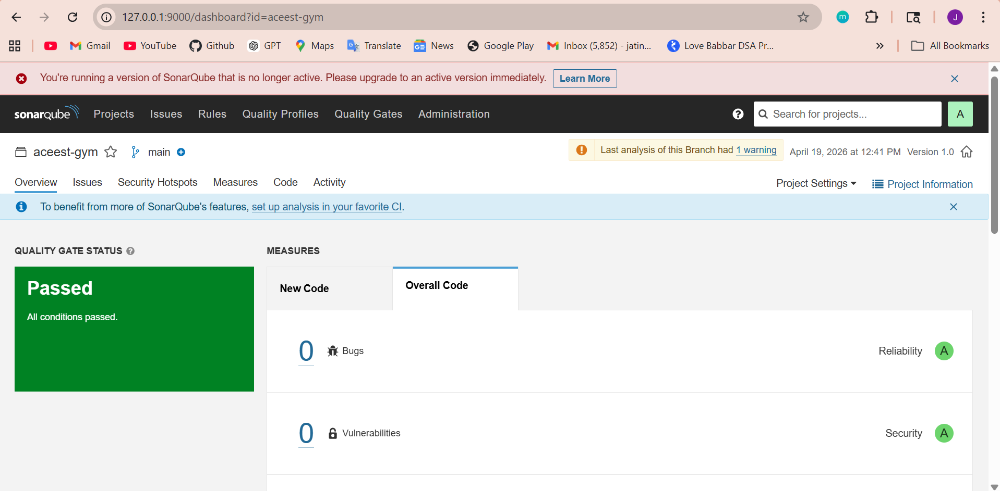
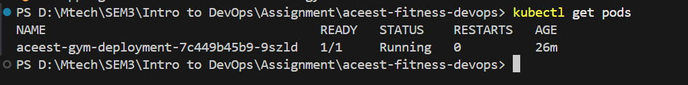
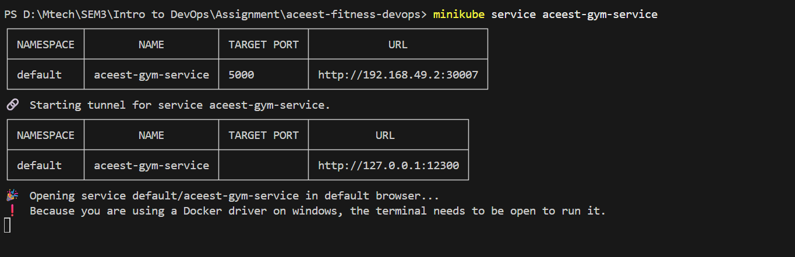
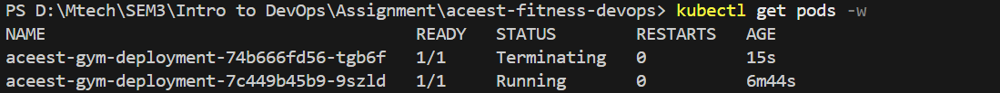

# ACEest Fitness & Gym – DevOps CI/CD Pipeline

## Project Overview:

This project demonstrates the implementation of a complete DevOps workflow for a Flask-based web application developed for ACEest Fitness & Gym.

The objective of the project is to design and implement an automated CI/CD pipeline that ensures code quality, automated testing, containerization, and reliable application deployment using modern DevOps tools.

The pipeline integrates the following technologies:

1. Git & GitHub for version control  
2. Pytest for automated unit testing  
3. Docker for containerization  
4. GitHub Actions for Continuous Integration (CI)  
5. Jenkins for pipeline automation  
6. SonarQube for code quality analysis  
7. Docker Hub for image storage and versioning  
8. Kubernetes (Minikube) for container orchestration and deployment  

The workflow ensures that whenever new code is pushed to the repository, it is automatically tested, analyzed for quality, containerized, and deployed in a consistent and scalable environment.


## Application Description

The application is a Flask-based REST API designed to simulate core functionalities of a fitness and gym management system. It serves as a lightweight backend service to demonstrate DevOps practices such as automated testing, containerization, and deployment.

### Features

- Health check endpoint to verify application status  
- View available fitness programs  
- Register new gym members  
- Retrieve registered member details  

The simplicity of the application allows it to be effectively used for demonstrating automated testing, CI/CD pipeline integration, and container-based deployment in a DevOps environment.

## Project Structure

```
aceest-gym-devops
│
├── app.py
├── requirements.txt
├── Dockerfile
├── Jenkinsfile
├── deployment.yaml
├── service.yaml
├── README.md
│
├── images
│   ├── flask-running.png
│   ├── pytest-output.png
│   ├── github-actions.png
│   ├── jenkins-pipeline.png
│   ├── docker-build.png
│   ├── sonarqube.png
│   ├── k8s-pods.png
│   ├── k8s-service.png
│   └── rollout.png
│
├── tests
│   └── test_app.py
│
└── .github
    └── workflows
        └── main.yml
```

### File Description:
1. app.py                         Flask web application  
2. requirements.txt               Python dependencies  
3. Dockerfile                     Docker image configuration  
4. Jenkinsfile                    Jenkins CI/CD pipeline definition  
5. deployment.yaml                Kubernetes deployment configuration  
6. service.yaml                   Kubernetes service configuration  
7. tests/test_app.py              Unit tests using Pytest  
8. .github/workflows/main.yml     GitHub Actions CI pipeline  
9. images/                        Contains project screenshots and outputs  
10. README.md                     Project documentation

## Running the Flask Application
1. Clone the Repository
```bash
    git clone https://github.com/jatin1410/aceest-gym-devops.git
    cd aceest-gym-devops
```
2. Install Dependencies
```bash
    pip install -r requirements.txt
```
    After installing dependencies, the Flask application can be started locally.
3. Run the Flask Application
```bash
    python app.py
```
The application will start at:
```
    http://localhost:5000
```
Example execution output:


## Running Unit Tests

The project uses **Pytest** for automated unit testing.  
The tests validate the functionality of the Flask API before the application moves to the build stage.

### Example Test Execution

Below is an example of running the test suite locally:


## Docker Containerization

The application is containerized using Docker to ensure consistent runtime environments.

### Docker Image Build

```bash
docker build -t aceest-gym-app . 
```
### Run Docker Container
```bash
    docker run -p 5000:5000 aceest-gym-app 
```
The following screenshot shows the Docker image successfully built for the application.


The API will be available at:
```text
    http://localhost:5000
```

## Continuous Integration – GitHub Actions

A CI pipeline is implemented using GitHub Actions.

### Workflow File
    .github/workflows/main.yml
### Pipeline Steps
    > Checkout repository
    > Install Python dependencies
    > Run unit tests using Pytest
    > Build Docker image
    > The pipeline automatically runs on:
    > Push to the main branch
    > Pull requests

This ensures that only tested and valid code moves forward in the development pipeline.

### GitHub Actions Pipeline Execution

Below is the GitHub Actions workflow showing successful CI execution.


## Jenkins Build Pipeline

Jenkins is used as a secondary build validation system.

### Jenkins Pipeline Stages
    1. Clone repository from GitHub
    2. Install project dependencies
    3. Execute unit tests
    4. Build Docker image

### Jenkins Pipeline Execution

The Jenkins pipeline automatically pulls the latest code from GitHub, installs dependencies, runs tests, and builds the Docker image.


## Jenkinsfile

The pipeline configuration is defined in Jenkinsfile. This file allows Jenkins to automatically execute the build steps when triggered.

## Advanced DevOps Pipeline (Assignment 2 Enhancements)

This project has been extended to include advanced DevOps practices:

- SonarQube integration for code quality analysis
- Docker Hub integration for image storage
- Kubernetes (Minikube) for container orchestration
- Deployment strategies (Rolling updates, Rollback, Blue-Green)


## Code Quality Analysis – SonarQube

SonarQube is integrated with Jenkins to enforce code quality checks.

Pipeline Step:
- Jenkins triggers SonarQube analysis
- Code is evaluated for bugs, vulnerabilities, and code smells
- Quality gate ensures only valid code proceeds



## Docker Hub Integration

Docker images are built and pushed to Docker Hub with version tags.

Example:

```bash
docker pull jatin2412/aceest-gym-app:v1
docker pull jatin2412/aceest-gym-app:v2
```

This enables version-controlled deployments.

## Kubernetes Deployment (Minikube)

The application is deployed on a Kubernetes cluster using Minikube.

### Pod Status

The following screenshot shows that the application pod is successfully running inside the Kubernetes cluster.



### Service Exposure

The application is exposed using a NodePort service, allowing external access.



Access the application using:

```bash
minikube service aceest-gym-service
```

## Deployment Strategies

The following deployment strategies are demonstrated:

### Rolling Update

The application supports rolling updates to ensure zero downtime during deployment.

The screenshot below shows an old pod being terminated while a new pod is created and becomes active.



### Rollback

Revert to the previous version using:

```bash
kubectl rollout undo deployment aceest-gym-deployment
```

## CI/CD Architecture

The overall DevOps workflow is illustrated below:

```
Developer
   ↓
GitHub
   ↓
GitHub Actions (CI)
   ↓
Jenkins
   ├── Pytest
   ├── SonarQube
   ├── Docker Build
   └── Docker Push
   ↓
Docker Hub
   ↓
Kubernetes (Minikube)
   ↓
Running Application
```

This automated pipeline improves development efficiency by ensuring code quality and build consistency.

## Technologies Used

> Python  
> Flask  
> Pytest  
> Docker  
> Docker Hub (Image Registry)  
> Git & GitHub (Version Control)  
> GitHub Actions (Continuous Integration)  
> Jenkins (Pipeline Automation)  
> SonarQube (Code Quality Analysis)  
> Kubernetes (Minikube for Container Orchestration)

## Conclusion

This project demonstrates the evolution of a complete DevOps pipeline from basic CI/CD to advanced deployment practices.

Starting with a Flask-based application, the system integrates version control, automated testing, containerization, and continuous integration using GitHub Actions and Jenkins. The pipeline is further enhanced with SonarQube for code quality analysis and Docker Hub for version-controlled image storage.

The final stage implements Kubernetes (Minikube) for container orchestration, enabling scalable and reliable deployment of the application. Advanced deployment strategies such as rolling updates and rollback mechanisms ensure zero-downtime releases and system stability.

Overall, this project reflects real-world DevOps practices by combining CI, quality assurance, and CD into a unified automated workflow, ensuring efficient, reliable, and production-ready software delivery.

## Author

**Jatin Upadhyay** <br>
**2024tm93717** <br>
M.Tech – Software Engineering <br>
DevOps Assignment – ACEest Fitness & Gym CI/CD Pipeline