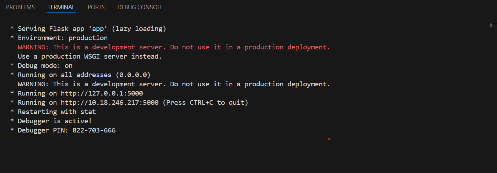
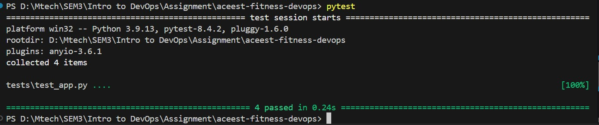
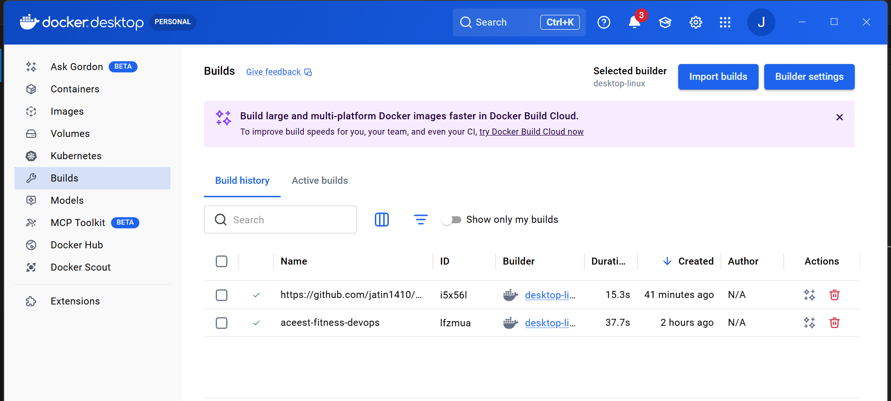
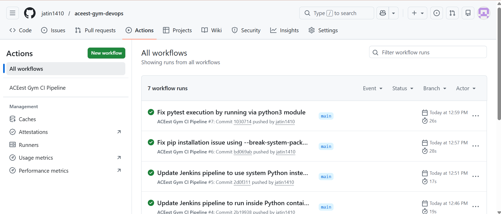
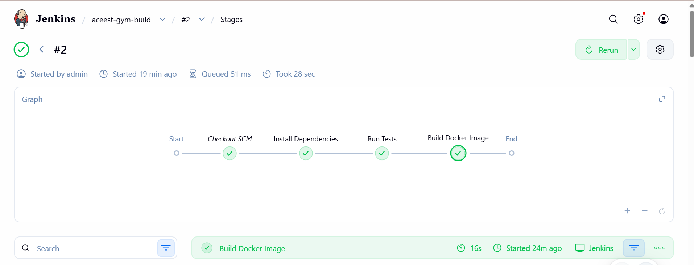

# ACEest Fitness & Gym – DevOps CI/CD Pipeline

## Project Overview:
This project demonstrates the implementation of a DevOps workflow for a simple Flask-based web application developed for ACEest Fitness & Gym.

The goal of the project is to build an automated development pipeline that ensures code quality, automated testing, and consistent application deployment using modern DevOps tools.

The pipeline integrates the following technologies:
1. Git & GitHub for version control
2. Pytest for automated unit testing
3. Docker for containerization
4. GitHub Actions for Continuous Integration (CI)
5. Jenkins for automated build validation

The workflow ensures that whenever new code is pushed to the repository, the application is automatically tested and validated before deployment.

## Application Description:

The application is a simple Flask REST API that simulates basic functionality for a fitness/gym management system.

### Features:
    - Check application health
    - View available fitness programs
    - Register new gym members
    - Retrieve registered members

This simple structure allows automated testing and CI/CD pipeline integration.

## Project Structure

```
aceest-gym-devops
│
├── app.py
├── requirements.txt
├── Dockerfile
├── Jenkinsfile
├── README.md
│
├── images
│   ├── flask-running.png
│   ├── pytest-output.png
│   ├── github-actions.png
│   ├── jenkins-pipeline.png
│   └── docker-build.png
│
├── tests
│   └── test_app.py
│
└── .github
    └── workflows
        └── main.yml
```

### File Description:
    1. app.py	                    Flask web application
    2. requirements.txt	            Python dependencies
    3. Dockerfile	                Containerization configuration
    4. Jenkinsfile	                Jenkins build pipeline
    5. tests/test_app.py            Unit tests using Pytest
    6. .github/workflows/main.yml	GitHub Actions CI pipeline

## Running the Flask Application
1. Clone the Repository
```bash
    git clone https://github.com/jatin1410/aceest-gym-devops.git
    cd aceest-gym-devops
```
2. Install Dependencies
```bash
    pip install -r requirements.txt
```
    After installing dependencies, the Flask application can be started locally.
3. Run the Flask Application
```bash
    python app.py
```
The application will start at:
```
    http://localhost:5000
```
Example execution output:



## Running Unit Tests

The project uses **Pytest** for automated unit testing.  
The tests validate the functionality of the Flask API before the application moves to the build stage.

### Example Test Execution

Below is an example of running the test suite locally:



## Docker Containerization

The application is containerized using Docker to ensure consistent runtime environments.

### Docker Image Build

```bash
docker build -t aceest-gym-app . 
```
### Run Docker Container
```bash
    docker run -p 5000:5000 aceest-gym-app 
```
The following screenshot shows the Docker image successfully built for the application.



The API will be available at:
```text
    http://localhost:5000
```

## Continuous Integration – GitHub Actions

A CI pipeline is implemented using GitHub Actions.

### Workflow File
    .github/workflows/main.yml
### Pipeline Steps
    > Checkout repository
    > Install Python dependencies
    > Run unit tests using Pytest
    > Build Docker image
    > The pipeline automatically runs on:
    > Push to the main branch
    > Pull requests

This ensures that only tested and valid code moves forward in the development pipeline.

### GitHub Actions Pipeline Execution

Below is the GitHub Actions workflow showing successful CI execution.



## Jenkins Build Pipeline

Jenkins is used as a secondary build validation system.

### Jenkins Pipeline Stages
    1. Clone repository from GitHub
    2. Install project dependencies
    3. Execute unit tests
    4. Build Docker image

### Jenkins Pipeline Execution

The Jenkins pipeline automatically pulls the latest code from GitHub, installs dependencies, runs tests, and builds the Docker image.



## Jenkinsfile

The pipeline configuration is defined in Jenkinsfile. This file allows Jenkins to automatically execute the build steps when triggered.

## CI/CD Architecture

The overall DevOps workflow is illustrated below:

```
Developer
   │
   ▼
GitHub Repository
   │
   ▼
GitHub Actions (CI)
   │
   ├── Install Dependencies
   ├── Run Pytest
   └── Build Docker Image
   │
   ▼
Jenkins Build Server
   │
   ├── Validate Build
   └── Build Docker Image
```

This automated pipeline improves development efficiency by ensuring code quality and build consistency.

## Technologies Used
    > Python
    > Flask
    > Pytest
    > Docker
    > GitHub Actions
    > Jenkins
    > Git

## Conclusion

This project demonstrates how DevOps practices can be applied to automate the software development lifecycle. By integrating version control, automated testing, containerization, and CI/CD pipelines, the system ensures reliable and consistent builds.

The implemented workflow reflects common industry practices for modern software delivery.

## Author

**Jatin Upadhyay** <br>
**2024tm93717** <br>
M.Tech – Software Engineering <br>
DevOps Assignment – ACEest Fitness & Gym CI/CD Pipeline